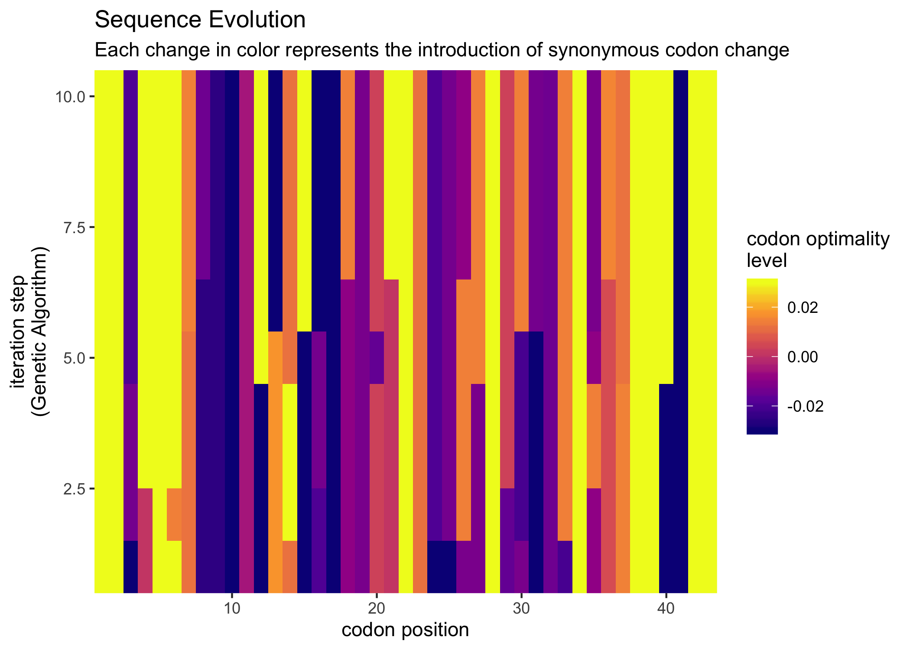
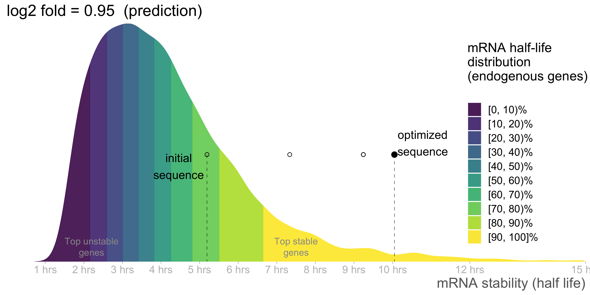

<!-- README.md is generated from README.Rmd. Please edit that file -->
optimalcodonR
=============

<!-- badges: start -->
[](https://travis-ci.org/santiago1234/optimalcodonR) <!-- badges: end -->

The goal of optimalcodonR is to ...

Installation
------------

You can install the released version of optimalcodonR from [CRAN](https://CRAN.R-project.org) with:

``` r
install.packages("optimalcodonR")
```

And the development version from [GitHub](https://github.com/) with:

``` r
# install.packages("devtools")
devtools::install_github("santiago1234/optimalcodonR")
```

Example
-------

This is a basic example which shows you how to optimize the gene expression of the following gene:

``` r
library(optimalcodonR)
cat(test_seq)
#> ATGTGGAGCGGCGGAGCTGAGCAACAACACCCTAAAACCGACAAATCTCACCGATGCAATGGCGTCGACAGCTCAAGAAGAAAGAACAGATCGCAGCGGTGGCGATATGAAGTCAAGAAAACTGGATGA
```

What is special about using `README.Rmd` instead of just `README.md`? You can include R chunks like so:

``` r
sequence <- training$coding[27]
result <- optimizer(sequence, specie = "mouse", n_iterations = 30, make_more_optimal = T)
#> optimizing sequence (more optimal)
#> starting genetic algorithm ...
#> .............................
```

Visualizing the results
-----------------------

``` r
visualize_evolution(result)
```



``` r
visualize_evolution(result, draw_heatmap = F)
```


