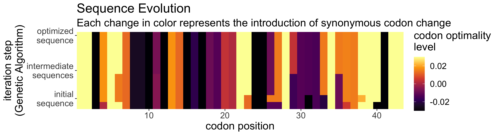

<!-- README.md is generated from README.Rmd. Please edit that file -->

# optimalcodonR 

<!-- badges: start -->

[](https://zenodo.org/badge/latestdoi/238309734)
[](https://travis-ci.org/santiago1234/optimalcodonR)
[](https://codecov.io/gh/santiago1234/optimalcodonR?branch=master)
[](https://www.tidyverse.org/lifecycle/#stable)
<!-- badges: end -->

This is the R package accompanying our publication: **opticon**

The goal of optimalcodonR is to …

### [Try our interactive web application\!](https://smedina.shinyapps.io/opticon/)

in production [Medina et al 2020](https://www.biorxiv.org/)

## :arrow\_double\_down: Installation

You can install the released version of optimalcodonR from
[GitHub](https://github.com/) with:

``` r
# install.packages("devtools")
devtools::install_github("santiago1234/optimalcodonR")
```

## :book: Example

This is a basic example which shows you how to optimize the gene
expression of the following gene:

``` r
library(optimalcodonR)
cat(test_seq)
#> ATGTGGAGCGGCGGAGCTGAGCAACAACACCCTAAAACCGACAAATCTCACCGATGCAATGGCGTCGACAGCTCAAGAAGAAAGAACAGATCGCAGCGGTGGCGATATGAAGTCAAGAAAACTGGATGA
```

What is special about using `README.Rmd` instead of just `README.md`?
You can include R chunks like so:

``` r
sequence <- test_seq
result <- optimizer(sequence, specie = "mouse", n_iterations = 10, make_more_optimal = T)
#> optimizing sequence (more optimal)
#> starting genetic algorithm ...
#> 2.3.4.5.6.7.8.9.10.
```

## Visualizing the results

``` r
visualize_evolution(result)
```



``` r
plot_optimization(result)
#> Picking joint bandwidth of 0.262
#> Warning: Removed 86 rows containing non-finite values (stat_density_ridges).
```


